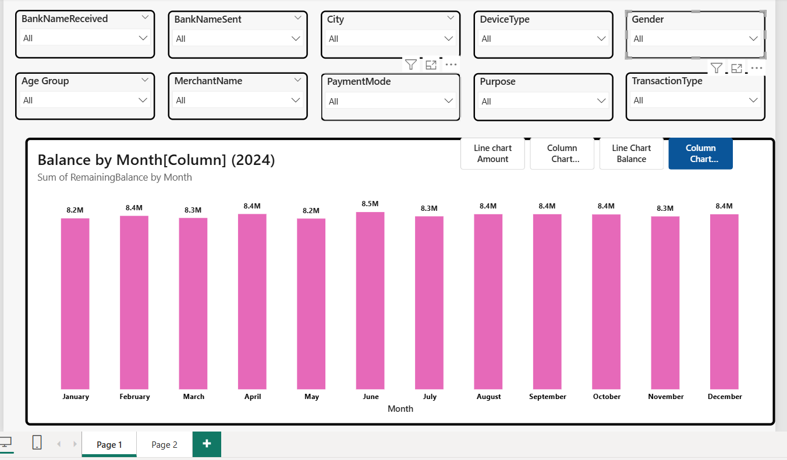
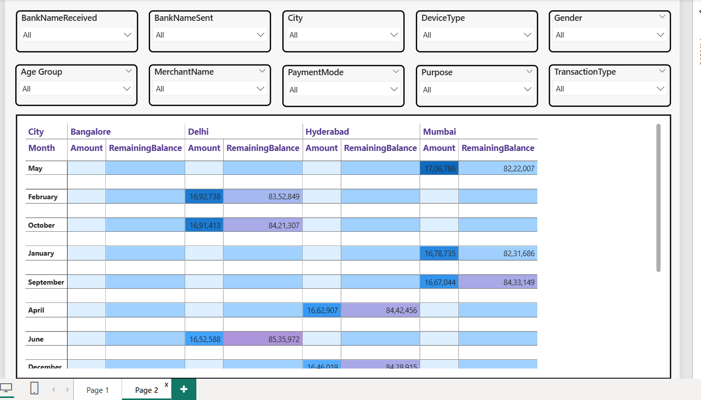

# 📊 Banking Transactions Analytics Dashboard (Power BI)

## 📝 Description  
- An interactive Power BI dashboard designed to analyze banking transaction data, providing insights into balances, transaction trends, and customer behavior. The dashboard includes dynamic filters and a chart toggle feature for flexible data visualization.
- Provides a concise monthly comparison of transaction performance across major cities with amount, remaining balance, and dynamic filters for deeper analysis.

## Monthly Banking Balance & Transaction Analytics Dashboard (Power BI)

### 🔍 Overview  
This dashboard provides a consolidated view of financial transactions across multiple dimensions such as banks, cities, payment modes, and customer demographics. Users can explore monthly trends and switch between column and line charts for better analysis.

### 🚀 Key Features  
-  Monthly balance trend analysis (2024)  
-  Toggle between **Column Chart and Line Chart**  
-  Interactive filters (Bank Name, City, Device Type, Transaction Type)  
-  Demographic insights (Gender & Age Group)  
-  Payment mode and merchant-wise analysis  
-  City-level transaction insights  
-  Fully interactive dashboard  

  

## City Wise Banking Transactions & Balance Analytics Dashboard (Power BI)

### 🔍 Overview

- Compares monthly transaction performance across major cities.
- Displays amount and remaining balance in a detailed tabular format.
- Supports dynamic filtering for customized and deeper analysis.

  